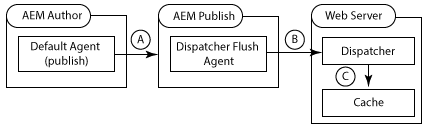
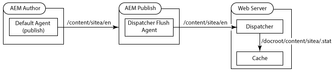

= Containerized AEM Dispatcher

Adobe’s recommendation is to use a whitelist strategy where only certain requests are allowed and all others are denied.

== Communicate between two rootless containers
----
    podman ps -a
    podman rm dispatcher
    podman image ls
    podman rmi d1c0bc426e4d

1.  podman pod ls
2.  podman pod rm xilu
3.  podman pod create --infra -p 8080:80 -p 8081:443 -p 4502:4502 -p 4503:4503 -p 3306:3306 -p 4389:10389 -p 4636:10636 -n xilu
----

== download so files
wget https://download.macromedia.com/dispatcher/download/dispatcher-apache2.4-linux-x86_64-4.3.3.tar.gz
wget https://download.macromedia.com/dispatcher/download/dispatcher-apache2.4-linux-x86_64-ssl1.1-4.3.3.tar.gz

== dispatcher.any syntax
. list all farms (aka sites), each farm defines behaviors for a domain (author.x, a.pub.x, b.pub.x)
. each farm define behavior ( which files to cache and where, load balance by statis)
. the list farms are evaluated bottom-up (so put specific urls at bottom)
. put /auth_checker farm at bottom
. per farm loader will be balanced among these render (host, port)
. /hostname "${PUBLISH_IP}"
. use virtualhosts to differentiate incoming url (auth, pub, site1, site2)

    /farms
      {
      $include "farm_*.any"
      }

----
1. Property names are prefixed with a forward slash /.
2. Multi-valued properties enclose child items using braces { }.
/farms
{
  /website_farm1
  {
    /clientheaders
    { # List of headers to pass through
      "*"
    }

    /virtualhosts
    { # List of URLs for this Web site,   [scheme]host[uri][*]
      "*"
    }
    
    /sessionmanagement
    { # caching everything for unauthenticated access and caching nothing for logged-in users
      # /allowAuthorized must be set to "0" in the /cache section
      # The directory that stores the session information. If the directory does not exist, it is created.
      /directory "/usr/local/apache/.sessions"
      /encode "md5"
      /header "HTTP:authorization"
      /timeout "800"
    }
   
    /renders
    { # List of AEM instances that render the documents
      /rend01
      { # /hostname, /port, /timeout
      }
    }
   
    /filter
    { # List of filters
      # If no /filter section exists, all requests are accepted.
      # Deny everything first and then allow specific entries
      /0001 { /type "deny" /glob "*" }
      /0011 { /type "allow" /url "/bin/*" }     # allow ajax servlet call
      /0012 { /type "allow" /url "/intranet*" } # allow mapped pages
      
      # Enable specific mime types in non-public content directories
      /0041 { /type "allow" /url "*.css"   }  # enable css
      /0042 { /type "allow" /url "*.gif"   }  # enable gifs
      /0043 { /type "allow" /url "*.ico"   }  # enable icos
      /0044 { /type "allow" /url "*.js"    }  # enable javascript
      /0045 { /type "allow" /url "*.png"   }  # enable png
      /0046 { /type "allow" /url "*.swf"   }  # enable flash
      /0047 { /type "allow" /url "*.jpg"   }  # enable jpg
      /0048 { /type "allow" /url "*.jpeg"  }  # enable jpeg
      
      #Font Filetypes
      /0049 { /type "allow" /url "*.ttf"  }  # enable true-type-fonts
      /0050 { /type "allow" /url "*.svg"  }  # enable svg
      /0051 { /type "allow" /url "*.eot"  }  # enable eot
      /0052 { /type "allow" /url "*.woff"  }  # enable woff
    }
   
    /vanity_urls
    { # List of vanity URLs
    }
   
    /cache
    { # Cache configuration
      /rules
      { # List of cachable documents
        /0000
        {
          /glob "*"  # cache everything first, and then specific entry
          /type "allow"
        }
      }
      
      /invalidate
      { # List of auto-invalidated documents
        /0000
        {
          /glob "*"
          /type "deny"   #delete nothing first, and then specific entry
        }
      }
      
      /allowedClients
      {
        /0000
        { # deny every ip first, and then allow only localhost to activate cache
          /glob "*"
          /type "deny"
        }
        /0001
        {
          /glob "127.0.0.1"
          /type "allow"
        }
      }
      
      /ignoreUrlParams
      {
        /0001 { /glob "*" /type "deny" }
        /0002 { /glob "afAcceptLang" /type "allow" }
      }
    }
   
    /statistics
    {
      /categories
      { # The document categories that are used for load balancing estimates
      }
    }
    
    /stickyConnectionsFor "/myFolder"
    
    /health_check
    { # Page gets contacted when an instance returns a 500
    }
    
    /retryDelay "1"
    /numberOfRetries "5"
    /unavailablePenalty "1"
    /failover "1"
  }
}
---- 

----
/clientheaders
  {
  "CSRF-Token"
  "X-Forwarded-Proto"
  "referer"
  "user-agent"
  "authorization"
  "from"
  "content-type"
  "content-length"
  "accept-charset"
  "accept-encoding"
  "accept-language"
  "accept"
  "host"
  "if-match"
  "if-none-match"
  "if-range"
  "if-unmodified-since"
  "max-forwards"
  "proxy-authorization"
  "proxy-connection"
  "range"
  "cookie"
  "cq-action"
  "cq-handle"
  "handle"
  "action"
  "cqstats"
  "depth"
  "translate"
  "expires"
  "date"
  "dav"
  "ms-author-via"
  "if"
  "lock-token"
  "x-expected-entity-length"
  "destination"
  "PATH"
  }
----

== docker Build

----
1. podman build -t dispatcher .
----

== docker Run

You will need to have an AEM publish instance running on [localhost:4503](http://localhost:4503).

To make sure 8080 is not being used by other: +
sudo lsof -nP -iTCP -sTCP:LISTEN

----
2. podman run -i -t --pod xilu --name dispatcher dispatcher
3. podman run --pod xilu -i -t -v /tmp:/tmp -v /home/xilu/Downloads/podVol:/xilu --name aem658 centaem658 bash
----

http://localhost:8080/content/forms/af/dc-sandbox/helloworld.html

== Invalidating Dispatcher Cache from AEM

----
The default admin user. You should create a dedicated user account for use with replication agents.
  1. default publish agent hits: http://localhost:4503/bin/receive?sling:authRequestLogin=1
  2. defautl flush agent hits: http://localhost:8000/dispatcher/invalidate.cache
  3. Using Dispatcher with Multiple Domains
      - Web content for both domains is stored in a single AEM repository.
      - The files in the Dispatcher cache can be invalidated separately for each domain.

  https://*webserver_name*:*port*/*virtual_host*/dispatcher/invalidate.cache
----

== Manually Invalidating the Dispatcher Cache
----
1. delete
    POST /dispatcher/invalidate.cache HTTP/1.1  
    CQ-Action: Activate  
    CQ-Handle: path-pattern
    Content-Length: 0

2. delete and recache
    POST /dispatcher/invalidate.cache HTTP/1.1  
    CQ-Action: Activate  
    Content-Type: text/plain   
    CQ-Handle: /content/geometrixx-outdoors/en/men.html  
    Content-Length: 36
    
    /content/geometrixx-outdoors/en.html

3. sample servlet code
    String server = "localhost"; 
    String uri = "/dispatcher/invalidate.cache";
    HttpClient client = new HttpClient();
    PostMethod post = new PostMethod("https://"+host+uri);
    post.setRequestHeader("CQ-Action", "Activate");
    post.setRequestHeader("CQ-Handle",handle);
    StringRequestEntity body = new StringRequestEntity(page,null,null);
    post.setRequestEntity(body);
    post.setRequestHeader("Content-length", String.valueOf(body.getContentLength()));
    client.executeMethod(post);
    post.releaseConnection();
----

== sticky connection of load balancer
----
The following configuration enables sticky connections for all the page
/stickyConnections {
  /paths {
    "/content/image"
    "/content/video"
    "/var/files/pdfs"
  }
}

When sticky connections are enabled, the dispatcher module sets the renderid cookie. This cookie doesn’t have the httponly flag, which should be added in order to enhance security.
----

== AMS (adobe cloud) dispatcher config files
----
conf
 author-farm.any
 author-invalidate-allowed.any
 author-renders.any
 author-vhosts.any
 clientheaders.any
 dispatcher.any
 httpd.conf
 magic
 publish-farm.any
 publish-invalidate-allowed.any
 publish-renders.any
 publish-vhosts.any
 rules.any
conf.d
 README
 autoindex.conf
 dispatcher_vhost.conf
 health_check.conf
 remoteip.conf
 userdir.conf
 welcome.conf.ignore
conf.modules.d
 00-base.conf
 00-dav.conf
 00-lua.conf
 00-mpm.conf
 00-mpm.conf.old
 00-proxy.conf
 00-systemd.conf
 01-cgi.conf
----
- Unfortunately, because the server IPs, URLs and other information is hard coded into the configuration files
- to solve this hard coded issue, let create a file 00-variables.conf, and use ${VARIABLE_NAME} instead

    # Public URLS
    Define PRIMARY_URL aem-dispatcher-dev.client.com
    Define SECONDARY_URL clientdev63.adobecqms.net
    # Author configurations
    Define AUTHOR_URL aem-author-dev.client.com
    Define AUTHOR_IP 10.55.44.33
    # Publisher configurations
    Define PUBLISH_IP 10.66.55.44

== SSI, include AEM content into the non-AEM websites
----
1. SSI is not enabled in Apache by default. you can do it globally, or per VirtualHosts
    # Add support for SSI
    Options +Includes
    AddOutputFilter INCLUDES .html

----

== Redirect Management Options
----
1. using Apache httpd Redirect Map text files or rewrites.
  Need to restart apache when text file updated
2. AEM Vanities are convenient, but has huge issue (performance, conflicts page by page)
3. using the Redirect Map Manager, an easy way to maintain lists of redirects in AEM
  https://github.com/Adobe-Consulting-Services/acs-aem-commons/releases/tag/acs-aem-commons-3.17.0
  which is manage-able, publish and consume by apache rewirte db, no downtime 
----

== Configuring an SSL (Secure Sockets Layer) connection
----
1. obtain a ssl certificate from a CA, or create a Self-Signed SSL Certificate (certificate.crt)
  openssl genrsa -aes128 -out private.key 2048
    @xwu2385W is pass phrase for privata.key
  openssl req -new -days 365 -key private.key -out request.csr
    ca, ontario, ottawa, dc, aem, aemdis, xiluwu@yahoo.com [country, prov, city, company name, unit, FQDN]
  openssl x509 -in request.csr -out certificate.crt -req -signkey private.key -days 365
2. above will create 3 files [private.key, request.csr, certificate.crt]
  RUN mkdir -p /etc/certificate
  ADD private.key /etc/certificate/private.key
  ADD certificate.crt /etc/certificate/certificate.crt

3. Configuring the Apache SSL parameters
  ADD ssl-params.conf /etc/apache2/conf-available/ssl-params.conf

4. change the Virtual Host
  ADD default-ssl.conf /etc/apache2/sites-available/default-ssl.conf

5. optional, configure the Firewall

6. Enable the mod_ssl and mod_headers modules
    RUN a2enmod ssl
    RUN a2enmod headers
    RUN a2enconf ssl-params
    RUN a2ensite default-ssl
7. check config
  apache2ctl configtest
----
https://localhost:8081/content/forms/af/dc-sandbox/helloworld.html

== bash mode, dispatcher rule guideline
----
// find ubuntu version
cat /etc/issue

apachectl start

Rule 1: Use /bin when configuring Servlets path
Rule 2: Disable servlet per runmode when not needed, such as:
  @Reference(name = "fd-service")
  private ServiceUserMapped serviceUserMapped;
Rule 3: Be restrictive
  bind your servlet to a resource type if possible
Rule 4: Whitelist rather than blacklist selectors and suffixes
----

== virtual hosts
you can use virtual hosts to encapsulate configuration details and host more than one domain from a single server.
----
let’s create a directory structure within /var/www for a your_domain site, 
leaving /var/www/html in place as the default directory to be served 
if a client request doesn’t match any other sites.

1. mkdir /var/www/your_domain
2. chown -R $USER:$USER /var/www/your_domain
3. chmod -R 755 /var/www/your_domain
4. nano /var/www/your_domain/index.html

Instead of modifying the default configuration file located 
at /etc/apache2/sites-available/000-default.conf directly, 
let’s make a new one at /etc/apache2/sites-available/your_domain.conf

5. nano /etc/apache2/sites-available/your_domain.conf
    <VirtualHost *:80>
        ServerAdmin webmaster@localhost
        ServerName your_domain
        ServerAlias www.your_domain
        DocumentRoot /var/www/your_domain
        ErrorLog ${APACHE_LOG_DIR}/error.log
        CustomLog ${APACHE_LOG_DIR}/access.log combined
    </VirtualHost>

6. a2ensite your_domain.conf
  To disable default site:  a2dissite 000-default.conf
7. test config error
  apache2ctl configtest
----

== Getting Familiar with Important Apache Files
----
    ls /var/log/apache2/
      access.log  error.log  dispatcher.log   other_vhosts_access.log  

  a2enconf/a2disconf   a2enmod/a2dismod    a2ensite/a2dissite   a2query

1. /etc/apache2/apache2.conf 
  is the main config file

2. /etc/apache2/ports.conf
  This file specifies the ports that Apache will listen on. 
  By default, Apache listens on port 80 and additionally listens on port 443 
  when a module providing SSL capabilities is enabled 

3. /etc/apache2/sites-available/
  The directory where per-site virtual hosts can be stored.
  
  Typically, all server block configuration is done in this directory, 
  and then enabled by linking to the other directory with the a2ensite command.
  
  a2ensite

4. /etc/apache2/sites-enabled/
  links created by "a2ensite"

5. /etc/apache2/conf-available/, /etc/apache2/conf-enabled/
  store config file which does not belong to a specific "virtual host"
  see a2enconf, a2disconf

6. /etc/apache2/mods-available/, /etc/apache2/mods-enabled/
  contain the available and enabled modules
----

== 10 must-know Apache directives and modules
- #mod_rewrite# is the rule-based rewrite engine that allows Apache to rewrite requested URLs on the fly.

    user-friendly URLs, such as map-legacy.txt
    /vanity1 https://www.site.com/afolder/apage.html
    /vanity2 https://apps.asite.com/An-App/In-IIS.aspx
      RewriteMap map.legacy txt:/etc/httpd/conf.d/map-legacy.txt
      RewriteMap lc int:tolower
      RewriteCond ${map.legacy:${lc:$1}} !=""
      RewriteRule ^(.*)$ ${map.legacy:${lc:$1}|/} [L,R=301]

- #Alias# is one of the must-use directives, allows you to point your Web server to directories outside your document root.
- #AddType# configures MIMEs, #AddHandler# configures extensions.
- #VirtualHost# allows you to create multiple virtual hosts (sites-available) on a single Apache server. 
- #DocumentRoot# defines the document root of the server. Change this directive only if you know exactly what you're doing.
- #KeepAlive# is an important directive. It defines whether a server allows more than one request per connection. +
    By default, KeepAlive is set to off, which prevents the server from becoming too busy.
- #Listen# is the directive used to define the port Apache listens on. default to 80    
- #LoadModule# is the directive used to inform the Apache server of a module to be loaded.
- #Options# allows you to define specific options per directory basis.
- #mod_speling#, supports three use cases:
      . Redirecting users to similarly named pages when they misspell the URL;
      . Redirecting users to pages with a different case than the URL the requested;
      . Displaying a list of similar URLs if they misspell a URL and there are multiple similar options;